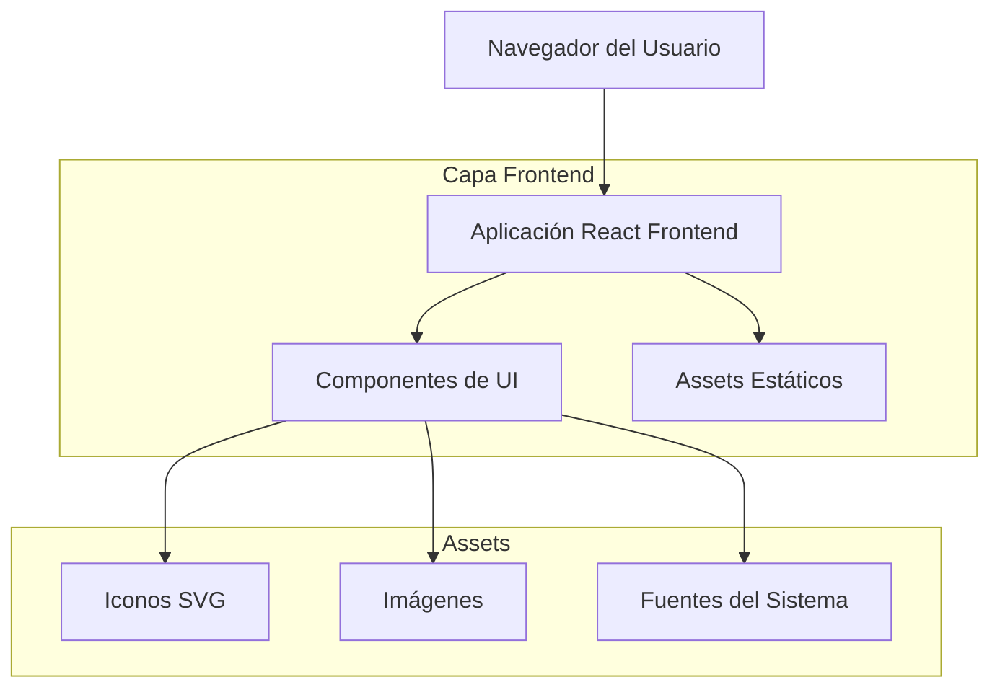

# Arquitectura Técnica - Landing Page Chat WhatsApp

## 1. Diseño de Arquitectura



## 2. Descripción de Tecnologías

- **Frontend**: React@18 + TypeScript + Tailwind CSS@3 + Vite
- **Backend**: Ninguno (landing page estática)
- **Iconos**: SVG personalizados idénticos a WhatsApp
- **Imágenes**: Optimizadas para web (WebP/JPEG)
- **Deployment**: Estático (Vercel/Netlify)

## 3. Definiciones de Rutas

| Ruta | Propósito |
|------|----------|
| / | Página principal del chat WhatsApp simulado |
| /desktop | Vista alternativa para desktop (opcional, puede ser responsive) |

## 4. Definiciones de Componentes

### 4.1 Estructura de Componentes React

```typescript
// Tipos principales
interface Message {
  id: string;
  type: 'text' | 'image' | 'sticker';
  content: string;
  timestamp: string;
  sent: boolean;
  delivered: boolean;
  read: boolean;
}

interface Contact {
  name: string;
  avatar: string;
  status: 'online' | 'offline' | 'typing';
  lastSeen?: string;
}

// Props de componentes
interface ChatHeaderProps {
  contact: Contact;
  onBack: () => void;
  onCall: () => void;
  onVideoCall: () => void;
}

interface MessageBubbleProps {
  message: Message;
  showTimestamp?: boolean;
}

interface ChatInputProps {
  onSendMessage: (message: string) => void;
  onAttach: () => void;
  onCamera: () => void;
  onVoice: () => void;
}
```

### 4.2 Componentes Principales

| Componente | Descripción | Props Principales |
|------------|-------------|------------------|
| WhatsAppChat | Componente principal que contiene toda la interfaz | messages, contact |
| ChatHeader | Barra superior con información del contacto | contact, onBack, onCall, onVideoCall |
| MessageList | Lista de mensajes con scroll automático | messages |
| MessageBubble | Burbuja individual de mensaje | message, showTimestamp |
| ChatInput | Barra inferior de entrada de texto | onSendMessage, onAttach, onCamera, onVoice |
| SVGIcon | Componente reutilizable para iconos SVG | name, size, color |

## 5. Definiciones de Estilos

### 5.1 Configuración Tailwind CSS

```javascript
// tailwind.config.js
module.exports = {
  content: ['./src/**/*.{js,ts,jsx,tsx}'],
  theme: {
    extend: {
      colors: {
        whatsapp: {
          primary: '#25D366',
          dark: '#075E54',
          light: '#DCF8C6',
          gray: '#E5E5EA',
          background: '#000000'
        }
      },
      fontFamily: {
        system: ['-apple-system', 'BlinkMacSystemFont', 'Segoe UI', 'Roboto', 'sans-serif']
      },
      spacing: {
        'chat': '60px'
      }
    }
  },
  plugins: []
}
```

### 5.2 Clases CSS Personalizadas

```css
/* Estilos específicos para el chat */
.chat-container {
  height: 100vh;
  max-width: 400px;
  margin: 0 auto;
  background: #000;
}

.message-bubble {
  max-width: 80%;
  word-wrap: break-word;
  border-radius: 18px;
  padding: 8px 12px;
  margin: 4px 8px;
}

.message-sent {
  background: #DCF8C6;
  margin-left: auto;
  border-bottom-right-radius: 4px;
}

.message-received {
  background: #E5E5EA;
  margin-right: auto;
  border-bottom-left-radius: 4px;
}

.esoteric-background {
  background-image: url('data:image/svg+xml;base64,...'); /* Patrón esotérico */
  background-repeat: repeat;
  background-size: 100px 100px;
}
```

## 6. Estructura de Archivos

```
src/
├── components/
│   ├── WhatsAppChat.tsx
│   ├── ChatHeader.tsx
│   ├── MessageList.tsx
│   ├── MessageBubble.tsx
│   ├── ChatInput.tsx
│   └── SVGIcon.tsx
├── assets/
│   ├── icons/
│   │   ├── back-arrow.svg
│   │   ├── phone.svg
│   │   ├── video-call.svg
│   │   ├── attach.svg
│   │   ├── camera.svg
│   │   ├── microphone.svg
│   │   └── send.svg
│   ├── images/
│   │   ├── maestro-gabriel-avatar.jpg
│   │   ├── religious-altar.jpg
│   │   └── prayer-hands-sticker.png
│   └── patterns/
│       └── esoteric-background.svg
├── data/
│   └── chatData.ts
├── styles/
│   └── globals.css
├── types/
│   └── index.ts
├── App.tsx
└── main.tsx
```

## 7. Datos de la Conversación

```typescript
// src/data/chatData.ts
export const chatData = {
  contact: {
    name: "Maestro Gabriel",
    avatar: "/assets/images/maestro-gabriel-avatar.jpg",
    status: "online" as const,
    lastSeen: "en línea"
  },
  messages: [
    {
      id: "1",
      type: "text" as const,
      content: "Hola bendiciones, como puedo ayudarte?",
      timestamp: "00:28",
      sent: false,
      delivered: true,
      read: true
    },
    {
      id: "2",
      type: "image" as const,
      content: "/assets/images/religious-altar.jpg",
      timestamp: "00:29",
      sent: false,
      delivered: true,
      read: true
    },
    {
      id: "3",
      type: "sticker" as const,
      content: "/assets/images/prayer-hands-sticker.png",
      timestamp: "00:30",
      sent: false,
      delivered: true,
      read: true
    }
  ]
};
```

## 8. Optimizaciones de Rendimiento

- **Lazy Loading**: Carga diferida de imágenes grandes
- **SVG Sprites**: Iconos SVG optimizados en sprite sheet
- **Responsive Images**: Múltiples tamaños para diferentes dispositivos
- **CSS-in-JS**: Estilos críticos inline para primera carga
- **Service Worker**: Cache de assets estáticos (opcional)

## 9. Compatibilidad y Testing

- **Navegadores soportados**: iOS Safari 12+, Android Chrome 70+, Desktop Chrome/Firefox/Safari
- **Testing**: Jest + React Testing Library para componentes
- **E2E Testing**: Cypress para flujos de usuario
- **Responsive Testing**: Múltiples viewports y dispositivos