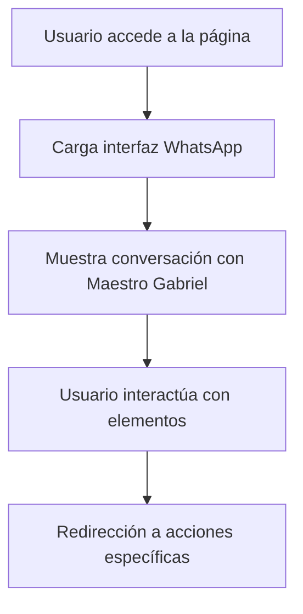

# Requisitos del Producto - Landing Page Chat WhatsApp

## 1. Descripción General del Producto

Landing page que simula perfectamente un chat de WhatsApp móvil, replicando la interfaz y experiencia de usuario de la aplicación original. La página presenta una conversación con "Maestro Gabriel" en un contexto esotérico/religioso, optimizada principalmente para dispositivos móviles (iOS y Android) que representan el 80% del tráfico.

- **Propósito principal**: Crear una experiencia inmersiva que simule una conversación real de WhatsApp para servicios esotéricos/espirituales
- **Usuarios objetivo**: Personas que buscan servicios espirituales/esotéricos, principalmente usuarios móviles
- **Valor del producto**: Generar confianza y familiaridad mediante la replicación exacta de la interfaz de WhatsApp

## 2. Características Principales

### 2.1 Roles de Usuario

| Rol | Método de Acceso | Permisos Principales |
|-----|------------------|---------------------|
| Visitante | Acceso directo a la URL | Puede ver la conversación simulada, interactuar con elementos básicos |

### 2.2 Módulo de Características

Nuestra landing page de chat WhatsApp consta de las siguientes páginas principales:

1. **Página Principal (Chat)**: Interfaz de chat completa, barra superior con información del contacto, área de mensajes, barra inferior de entrada
2. **Vista Desktop**: Diseño alternativo optimizado para pantallas grandes

### 2.3 Detalles de Páginas

| Nombre de Página | Nombre del Módulo | Descripción de Características |
|------------------|-------------------|--------------------------------|
| Página Principal | Barra Superior | Mostrar avatar de "Maestro Gabriel", nombre, estado "en línea", iconos de llamada y videollamada, botón de retroceso |
| Página Principal | Área de Mensajes | Mostrar conversación con mensajes de texto y multimedia, burbujas de chat con colores correctos, timestamps, indicadores de entrega |
| Página Principal | Mensaje de Texto | Mostrar "Hola bendiciones, como puedo ayudarte?" con timestamp 00:28 y doble check verde |
| Página Principal | Mensaje de Imagen | Mostrar imagen religiosa con altar, crucifix, velas rojas, libro abierto, calavera y cristales, con timestamp 00:29 y doble check azul |
| Página Principal | Mensaje de Sticker | Mostrar sticker de manos en oración con timestamp 00:30 y doble check azul |
| Página Principal | Barra Inferior | Campo de entrada de texto, iconos de adjuntar, cámara, micrófono, todos en formato SVG |
| Página Principal | Fondo | Patrón de fondo oscuro con elementos esotéricos (estrellas, lunas, cristales) idéntico al mostrado |
| Vista Desktop | Layout Adaptativo | Diseño centrado con máximo ancho, manteniendo proporciones móviles |

## 3. Proceso Principal

**Flujo del Usuario:**

1. El usuario accede a la landing page
2. Ve inmediatamente la interfaz de WhatsApp con la conversación iniciada
3. Puede observar los mensajes del "Maestro Gabriel"
4. La experiencia simula una conversación real para generar engagement
5. Los elementos interactivos pueden dirigir a acciones específicas (contacto, servicios)

## 4. Diseño de Interfaz de Usuario

### 4.1 Estilo de Diseño

- **Colores primarios**: 
  - Verde WhatsApp: #25D366
  - Verde oscuro header: #075E54
  - Gris claro burbujas recibidas: #E5E5EA
  - Verde burbujas enviadas: #DCF8C6
  - Fondo negro: #000000
- **Estilo de botones**: Iconos SVG circulares, estilo flat design de WhatsApp
- **Fuente**: San Francisco (iOS) / Roboto (Android) - fuente del sistema
- **Tamaños de fuente**: 16px para mensajes, 14px para timestamps, 18px para nombre de contacto
- **Estilo de layout**: Diseño vertical móvil-first, elementos apilados
- **Iconos**: Todos los iconos deben ser SVG idénticos a WhatsApp (no emojis)

### 4.2 Resumen de Diseño de Páginas

| Nombre de Página | Nombre del Módulo | Elementos de UI |
|------------------|-------------------|----------------|
| Página Principal | Barra Superior | Fondo verde #075E54, avatar circular 40px, texto blanco, iconos SVG blancos alineados a la derecha |
| Página Principal | Área de Mensajes | Fondo con patrón esotérico, burbujas redondeadas con sombra sutil, padding 12px, margin 8px |
| Página Principal | Mensaje Entrante | Burbuja gris #E5E5EA, texto negro, timestamp gris pequeño, alineación izquierda |
| Página Principal | Mensaje Saliente | Burbuja verde #DCF8C6, texto negro, timestamp gris pequeño, doble check, alineación derecha |
| Página Principal | Imagen en Chat | Contenedor redondeado, imagen responsive, overlay con timestamp, indicadores de entrega |
| Página Principal | Barra Inferior | Fondo gris claro, campo de entrada redondeado, iconos SVG grises, altura 60px |

### 4.3 Responsividad

- **Enfoque**: Mobile-first design con adaptación para desktop
- **Breakpoints**: 
  - Móvil: 320px - 768px (diseño principal)
  - Desktop: 769px+ (diseño centrado con max-width 400px)
- **Optimización táctil**: Elementos interactivos mínimo 44px, espaciado adecuado para dedos
- **Compatibilidad**: iOS Safari, Android Chrome, optimización para ambos sistemas operativos